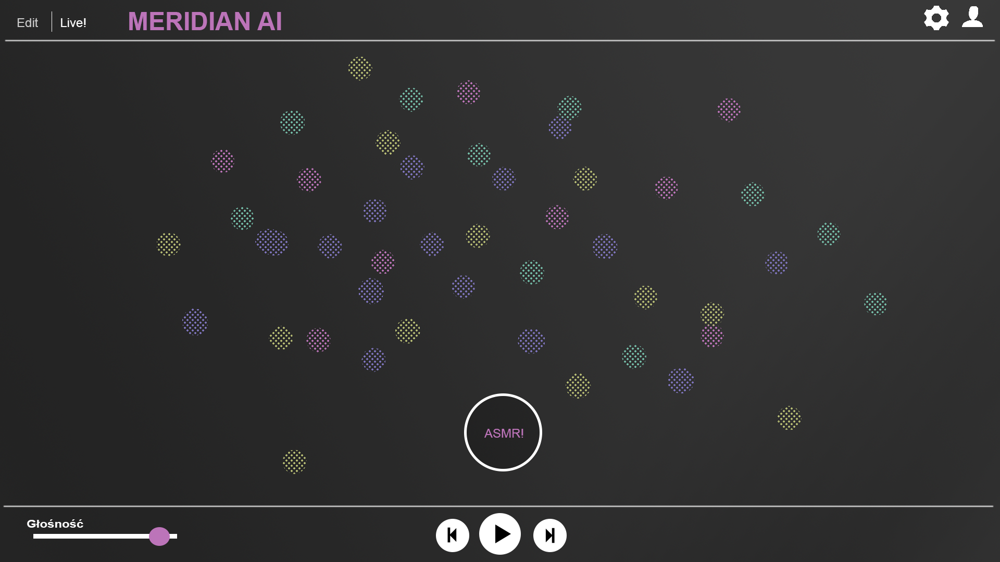
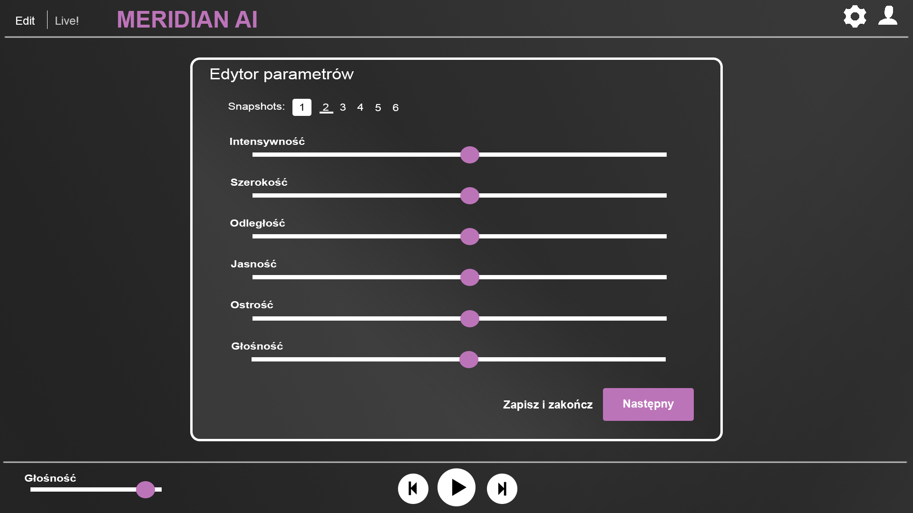

# Main UI

Zadaniem modułu jest dostarczenie głównego interfejsu użytkownika aplikacji.

## Wymagania
* Kontrola odtwarzania symulacji:
  * start
  * stop
  * głośność globalna
  * powrót do poprzedniego stanu parametrów
  * wylosowanie nowego stanu parametrów
  * zapisanie aktualnego stanu w *ulubionych* (snapshots)
* W trybie *Live!* powinien wyświetlać tylko wyżej wymienione kontrolki, interaktywne animacje, oraz dostęp do ustawień i konta użytkownika
* W trybie *Edit* lub *Learn* powinien wyświetlać modal dialog z możliwością kontroli 7 parametrów oraz odtworzenia dźwięku w celu usłyszenia wprowadzanych zmian, ponadto:
  * powinien umożliwiać zapisywanie dokonanych zmian parametrów do 6 snapshotów
  * pominien umożliwiać zakończenie edycji w dowolnym momencie
* Widok ustawień - *na razie nie zdefiniowano co mają zawierać ustawienia*
* Formularz logowania i edycja ustawień konta
* Responsywność

## Uwaga odnośnie trybu Edit

**W obecnych założeniach możliwa jest jedynie zmiana parametrów dla wszystkich dźwięków, które będą odtwarzane, podczas gdy tryb _Live!_ kontroluje parametry dla każdego dźwięku oddzielnie. Należy zastanowić się nad rozwiązaniem tego problemu**

Przykładowe rozwiązania:
* Ustawianie parametrów dla każdego dźwięku w bazie oddzielnie - czasochłonne, oderwane od miksu
* Kontrola parametrów globalnie dla pojedyńczej warstwy dźwiękowej - mniej czasochłonne jednak wciaż w przypadku wielu zestawów nierealne
* Przy założeniu kategoryzacji każdego dźwięku kontrola parametrów wybranego jednego dźwięku z każdej kategorii.

## Design

Poniżej zaprezentowano projekty wyglądu poszczególnych okien aplikacji.

### Tryb Live!

### Tryb edycji

### Formularz logowania

### Edycja konta
### Ustawienia